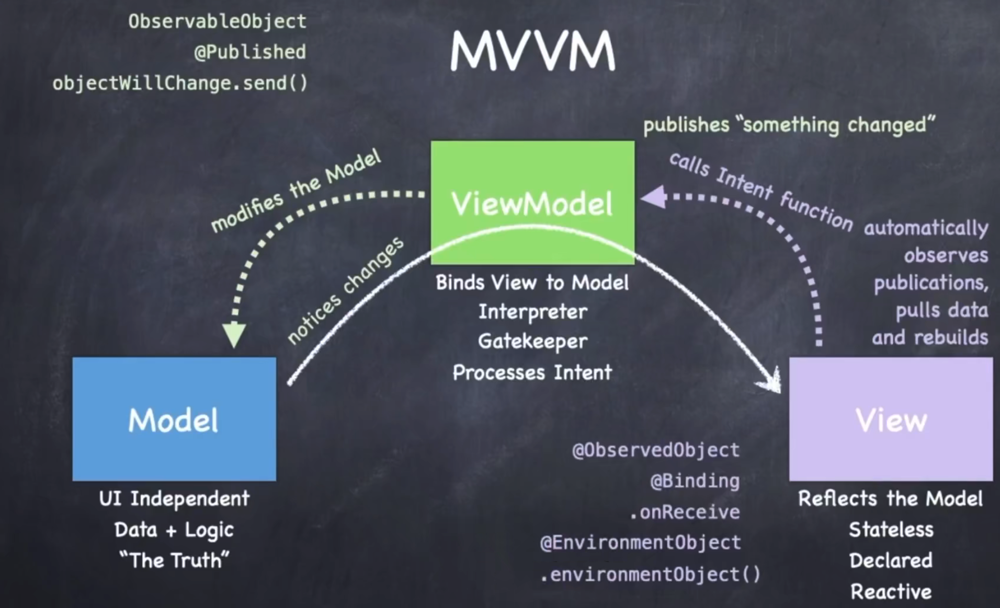

[](https://www.digitalocean.com/?refcode=2089a0d80556&utm_campaign=Referral_Invite&utm_medium=Referral_Program&utm_source=badge)
# Architecture
## MVVM
- Design paradigm
## Swift Type System
- struct
- class
- protocol
- "Don't Care" type (aka generics)
- enum
- functions

# MVVM
## Model-View-ViewModel
A "code organizing" architecture design paradigm.

Must be adhered to for SwiftUI to work.

It is different from MVC (Model View Controller) that UIKit (old-style iOS) uses.

An important rule in MVVM: The View must always get data from the model by asking for it from the ViewModel.

The ViewModel never stores the data for the Model inside of itself.

The model is still the truth, it always is the truth.

## truth
Because a lot of ViewModels create their own Model, a lot of times we say that the ViewModels are "the truth" in our app.

But the ViewModel is just an intermediary that's passing the data along from the Model to the View, perhaps cleaning it up, or interpreting it as it flies by.

But having this rule, that the View always this has to go through the ViewModel, puts the ViewModel in a great spot to help with this reactive mechanism we talked about that's so important to making all this work.


## How does it do that?
- First a ViewModel is constantly noticing changes in the model. 
Swift has the ablility to automatically track changes to a struct when we talk about the Swift type system. 
If the Model were let's say something more complicated like a SQL database, it's quite easy to insert something into the database which notifies you when there are changes. Or if the Model were something on the network, then obviously there are ways to get woken up when data appears from the network, and the ViewModel could do that as well. 
It's obviously a must in MVVM that the ViewModel be able to track all changes in the model.
When the ViewModel does notice a change, it immediately publishes "something changed" to the entire world. 
And anyone who is interested can listen for these pronouncements.
## Why does it say "something changed" to the entire world?
For a very important reason, the ViewModel does not wanna have any connections to any of the Views that are using it to access the Model.
It's up to the Views to sign themselves up to listen for these change announcements.

The terminology we use here is that the Views are subscribing to what the ViewModel is publishing. And what it's publishing is, something changed in the model.
So when SwiftUI sees that a publishing event has happened for a View is subscribed to that ViewModel's announcement, it asks the View for his body var and redraw it.
When the View is providing that body var, it is looking at the current state of the Model, and it's doing that through the ViewModel. So, that way the ViewModel can do its job of interpreting the Model data for the View.

To make all this easy to set up, when a View sets itself up to access the Model through the ViewModel, it does so in a way that it simulaneously subscribes to the announcements that the ViewModel is making about changes in the model.

Therefore, it can never be out of sync with the Model.

## What about the other direction?
We talked about how the View is always finding out about changes and being rebuilt to show the latest state of the Model, but how does the Model get changed by touch events happening in the View?
Taps, swipes, navigating around in the UI. Presumably some of that is going to cause the model to change. 

We handle that by adding another reponsibility to the ViewModel, processing user intents.

We say it this way because users are essentially expressing their intentions to change the Model through these touch events.

And so we add functions to our ViewModel which allow the View to say, "Oh, the user just did something in my View, and by doing so she intends the following conceptual thing to happen in the Model: whatever."
Then the ViewModel translates those intentions into specific modifications to the Model. 


# struct and class
## Both struct and class have ..,
- stored vars
- computed vars
- constant lets
- functions
- initializers

## what's the difference between struct and class?
|struct|class|
|-|-|
|Value type|Class type|
|Copied when passed or assigned|Passed around via pointers|
|Copy on write|Automatically reference counted|
|Functional programming|Object-oriented programming|
|No inheritance|Inheritance (single)|
|"Free" init initializes All vars|"Free" init initializes No vars|
|Mutability must be explicitly stated|Always mutable|
|Your "go to" data structure|Used in specific circumstances|
|Everything you've seen so far is a struct (except View which is a protocol)|The ViewModel in MVVM is always a class (also, UIKit (old stytle iOS) is class-based)|

# Generics
## Sometimes we just `don't care`
We may want to manipulate data structures that we are "type agnostic" about.

In other words, we don't know what type something is and we don't care.

But Swift is a strongly-typed language, so we don't use variables and such that are "untyped".

So how do we specify the type of something when we don't care what type it is?

We used a "don't care" type (we call this feature "generics") ...
## Example of a user of a "don't care" type: Array

Awesome example of generics: Array

An Array contains a bunch of things and it doesn't care at all what type they are!

But inside Array's code, it has to have variables for the things it contains. They need types.

And it needs types for the arguments to Array functions that do things like adding items to it.

## How Array uses a "don't care" type
Array's declarstion looks somthing like this ...
```swift
struct Array<Element> {
    ...
    func append(_ element: Element) { ... }
}
```
The type of the argumnet to append is Element. A "don't care" type.

Array's implementation of append knows nothing about that argumnet and id does not care.

Element is not any known struct or class or protocol, it's just a placeholder for a type.

The code for using an Array looks something like this ...
```swift
var a = Array<Int>()
a.append(5)
a.append(22)
```
When someone uses Array, that's when Element gets determined (by Array<Int>).


## Type Parameter
I will often refer to these types like Element in Array as a "don't care" type.

If you ask Array what type its elements are, it will say "I don't care".

But its actual name is Type Parameter.

# Functions as Types
## Functions are people too! (* er, types)
You can declare a variable (or parameter to a func or whatever) to be of type "function".

The syntax for this includes the types of the arguments and return value.

You can do this anywhere any other type is allowed.

Examples ...
```swift
(Int, Int) -> Bool // takes two Ints and returns a Bool
(Double) -> Void // takes a Double and returns nothing
() -> Array<String> // takes no arguments and returns an Array of Strings
() -> Void // takes no arguments and returns nothing (this is a common one)

var foo: (Double) -> Void // foo's type: "function that takes a Double, return nothing"
func doSomething(what: () -> Bool) {

} // what's type: "function, takes nothing, returns Bool"

var operation: (Double) -> Double // 

func square(operand: Double) -> Double {
    return operand * operand
}

operation = square // just assigning a value to the operation var, nothing more
let result1 = operation(4) // result1 would equal 16
```
Note that we don't use argument labels (e.g. `operand:`) when executing function types.
```swift
operation = sqrt // sqrt is a built-in function which happens to take and return a Double
let result2 = operation(4) // result2 would be 2
```
## Closures
It's so common to pass functions around that we are very often "inlining" them.

We call such an inlined function a "closure" and there's special language support for it.

### Those functions capture some of the state in the environment that they're in.

Remember that we are mostly doing "functional programming" in SwiftUI.

As the very name implies, "functions as types" is a very important concept in Swift.

[](https://www.digitalocean.com/?refcode=2089a0d80556&utm_campaign=Referral_Invite&utm_medium=Referral_Program&utm_source=badge)


